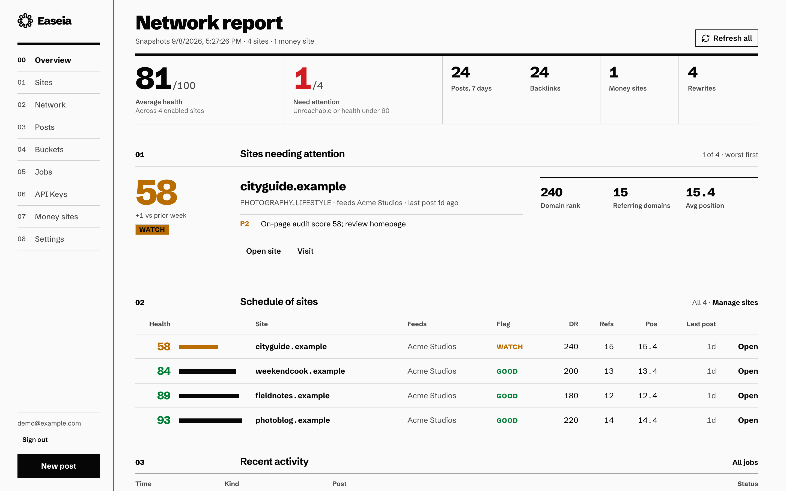
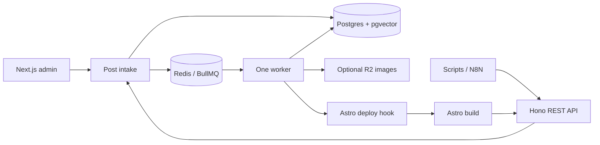

<p align="center"></p>

# Easeia

Open-source dashboard and API for running a private blog network of Astro sites.

Easeia manages per-site drafts, scheduled publishing, links to money sites, and search reports. It stores content in Postgres, runs publishing jobs through BullMQ, and gives each Astro build a site-scoped content API.



_Demo data: four fictional Astro blogs and one money site._

## Who it is for

Affiliate and SEO operators managing their own sites. Each instance is a shared administration space: **every registered user can manage every site, post, and API key**. The default signup mode admits the first administrator and then closes registration.

This is not a multi-tenant client CMS, a WordPress publisher, or a promise of search rankings. Self-hosted software is free under MIT. Cloud is a waitlist with pricing still to be announced.

## Features

- Create sites, configure deploy hooks, write Markdown, and publish from the dashboard.
- Fill per-site draft buckets with AI and publish on a schedule.
- Inspect a cross-site link graph and review suggestions for money-site targets.
- Connect DataForSEO for rankings and audits, and Google Search Console for search performance.
- Automate drafts, publishing, and job checks through a REST API with scoped bearer keys.
- Run without AI, SEO, mail, or image-storage credentials; optional features explain what they need.

## Quick start

Install Docker with Compose v2, then:

```sh
git clone https://github.com/unlockers-io/easeia-monorepo.git
cd easeia-monorepo
cp .env.selfhost.example .env.selfhost
${EDITOR:-vi} .env.selfhost
docker compose --env-file .env.selfhost -f compose.selfhost.yml up --build -d
```

In the editor, set separate `POSTGRES_PASSWORD` and `BETTER_AUTH_SECRET` values using `openssl rand -hex 32`, and `WP_ENCRYPTION_KEY` using `openssl rand -base64 32`. The database password must be URL-safe; generated hexadecimal works.

Open <http://localhost:3000/register> to create your administrator. Add a site, configure its deploy hook, and save your first draft. Publishing writes the content and requests a build; your Astro consumer must be configured for that build to produce pages.

The [self-hosting guide](docs/self-hosting.md) covers HTTPS, upgrades, backups, and existing databases. Keep exactly one worker replica because its scheduler runs inside the process. The API reference is at <http://localhost:4000/docs>.

## Development

Use **Node 24** and **pnpm 11** (the exact pnpm version is pinned in `package.json`).

```sh
pnpm install
cp .env.example .env
# Set the four required values and the plain-localhost URL settings in .env.
docker compose up -d
pnpm db:push
pnpm dev:plain
```

The development database listens on **5440**, Redis on **6381**. Plain app URLs are web <http://localhost:3000>, landing <http://localhost:3001>, and API <http://localhost:4000>. Set `WEB_APP_URL`, `CORS_ORIGINS`, `NEXT_PUBLIC_WEB_APP_URL`, and the landing-only `NEXT_PUBLIC_API_URL` to match these addresses. `dev:plain` loads the root `.env` and needs no global proxy.

Portless HTTPS URLs remain available with `pnpm dev`; see [CONTRIBUTING.md](CONTRIBUTING.md).

```sh
pnpm lint
pnpm typecheck
pnpm test
pnpm format:check
pnpm fallow:dead
# With web, API, and landing running against a disposable database:
pnpm test:e2e
```

Browser tests create full administrator accounts and synthetic sites. Use a dedicated test instance with `SIGNUP_MODE=open`; cleanup deletes only recorded synthetic test entries. Set `E2E_WEB_URL`, `E2E_API_URL`, and `E2E_LANDING_URL` to override automatic local URL discovery.

## Architecture



| App            | Purpose                                                                                       |
| -------------- | --------------------------------------------------------------------------------------------- |
| `apps/web`     | Next.js 16 administration and Better Auth server; server actions call shared packages         |
| `apps/landing` | Static marketing pages and a browser form for the public waitlist API; no database dependency |
| `apps/api`     | Hono REST API, bearer-key authorization, OpenAPI, Scalar, and build endpoints                 |
| `apps/worker`  | BullMQ jobs plus publishing, crawl, snapshot, and refill schedulers                           |

| Packages                                                               | Purpose                                                     |
| ---------------------------------------------------------------------- | ----------------------------------------------------------- |
| `@repo/db`, `@repo/auth`, `@repo/policy`                               | Prisma/Postgres, sessions, and authorization                |
| `@repo/posts`, `@repo/sites`, `@repo/jobs`                             | Post intake, site lifecycle, deploy hooks, and durable jobs |
| `@repo/ai`, `@repo/hero`, `@repo/rewrite`, `@repo/classify`            | Text, image, rewrite, and categorization pipelines          |
| `@repo/links`, `@repo/suggest-links`, `@repo/money-sites`              | Link graph, suggestions, and commercial targets             |
| `@repo/dataforseo`, `@repo/search-console`, `@repo/health`             | Provider clients and on-page SEO checks                     |
| `@repo/blob`, `@repo/transactional`                                    | R2 storage and optional Resend mail                         |
| `@repo/api-types`, `@repo/ui`, `@repo/observability`                   | Shared schemas, React components, and structured logging    |
| `@repo/typescript-config`, `@repo/config-vitest`, `@repo/portless-env` | Shared development configuration                            |
| `@easeia/astro-content`                                                | Published Astro loader and image-prefetch CLI               |

TypeScript is strict. Next.js builds the browser apps; tsdown bundles API and worker. Turborepo coordinates pnpm workspaces. See [AGENTS.md](AGENTS.md) for the complete repository map.

## Configuration

The four required application values are `DATABASE_URL`, `REDIS_URL`, `BETTER_AUTH_SECRET`, and `WP_ENCRYPTION_KEY`. The latter encrypts OAuth tokens at rest and retains its historical variable name. Public URLs, CORS, and trusted hosts must match your deployment.

| Feature                            | Environment                                                                                  |
| ---------------------------------- | -------------------------------------------------------------------------------------------- |
| AI drafts, rewrites, embeddings    | `OPENAI_API_KEY`                                                                             |
| Generated images                   | OpenAI plus all `R2_*` values                                                                |
| R2 image storage                   | `R2_ENDPOINT`, `R2_ACCESS_KEY_ID`, `R2_SECRET_ACCESS_KEY`, `R2_BUCKET`, `R2_PUBLIC_BASE_URL` |
| Rankings and audits                | `DATAFORSEO_LOGIN`, `DATAFORSEO_PASSWORD`                                                    |
| Search Console                     | `GOOGLE_OAUTH_CLIENT_ID`, `GOOGLE_OAUTH_CLIENT_SECRET`                                       |
| Verification and password recovery | `RESEND_API_KEY`, `FROM_EMAIL`                                                               |
| Registration                       | `SIGNUP_MODE=first-user` (default), `closed`, or `open`                                      |
| Text/image model selection         | `OPENAI_GENERATION_MODEL`, `OPENAI_REWRITE_MODEL`, `OPENAI_IMAGE_MODEL`                      |

See [.env.example](.env.example) for the full set. The dashboard’s **Settings → Integrations** identifies missing variables without showing their values. Embeddings remain fixed at 1536 dimensions; changing that requires a schema change and re-embedding.

## Connect an Astro site

Install `@easeia/astro-content`, create a site-scoped `content:read` key, and configure `easeiaLoader()` in `src/content.config.ts`. Build credentials stay in the site's CI, outside browser bundles. Use `heroImageUrl` and its dimensions when rendering heroes.

Follow the complete [Astro integration guide](docs/astro-integration.md), including image prefetch and deploy-hook setup. The API serves `/openapi.json`, `/docs`, and `/llms.txt` on your own API host.

## Cloud

Managed hosting is planned. [Join the Cloud waitlist](https://easeia.com/#waitlist); pricing and availability will be announced at launch. Joining does not create a subscription or administrator account.

## Contributing, security, and license

Read [CONTRIBUTING.md](CONTRIBUTING.md) and the [Code of Conduct](CODE_OF_CONDUCT.md). Report security issues privately as described in [SECURITY.md](SECURITY.md).

[MIT](LICENSE) © 2026 Pedro Filho.
