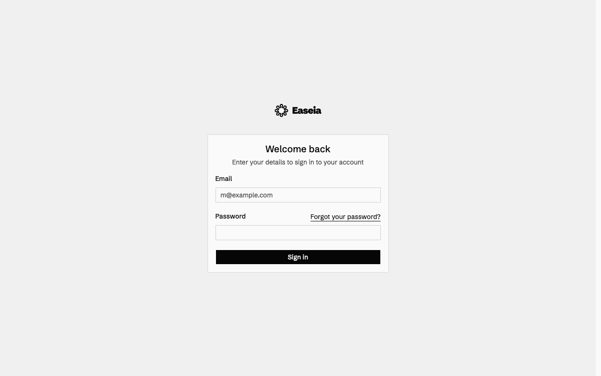
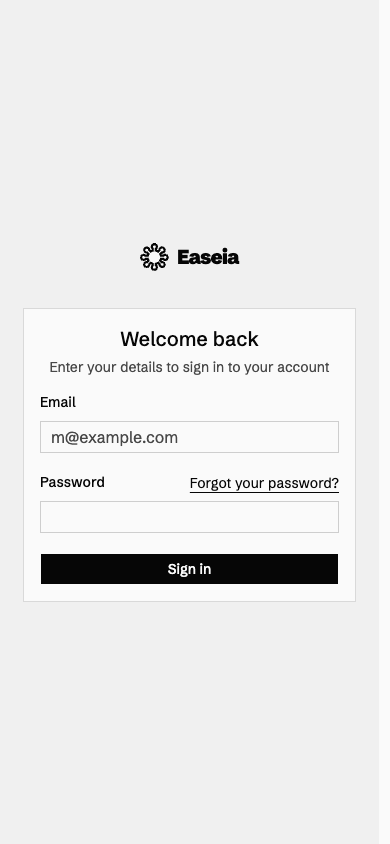

# shadcn visual comparison

Before: the login page as it stood before the shadcn primitives were aligned. After: the same page on the aligned primitives.

Inputs become shorter and lose their custom shadows. The card gains a full border instead of only a top rule, and the heading weight/form spacing change. The square monochrome theme is preserved.

Manually compared matching desktop (1280×800) and mobile (390×844) viewports in Chromium, light theme, reduced motion. No horizontal overflow or unexpected clipping was observed in the sampled after states. This covers the pages/states below, not every screen, authenticated flow, or dark-mode state.

The hosted preview returns an error because BETTER_AUTH_SECRET and REDIS_URL are missing. These requirements predate this PR. Both screenshots use local worktrees with identical local environment settings and signup closed; no database writes or emails were triggered.

## Empty login form, signup closed

App: `web`. Route: `/login`. Same route and state on both commits.

Desktop

| Before                              | After                             |
| ----------------------------------- | --------------------------------- |
|  |  |

Mobile

| Before                             | After                            |
| ---------------------------------- | -------------------------------- |
|  |  |
